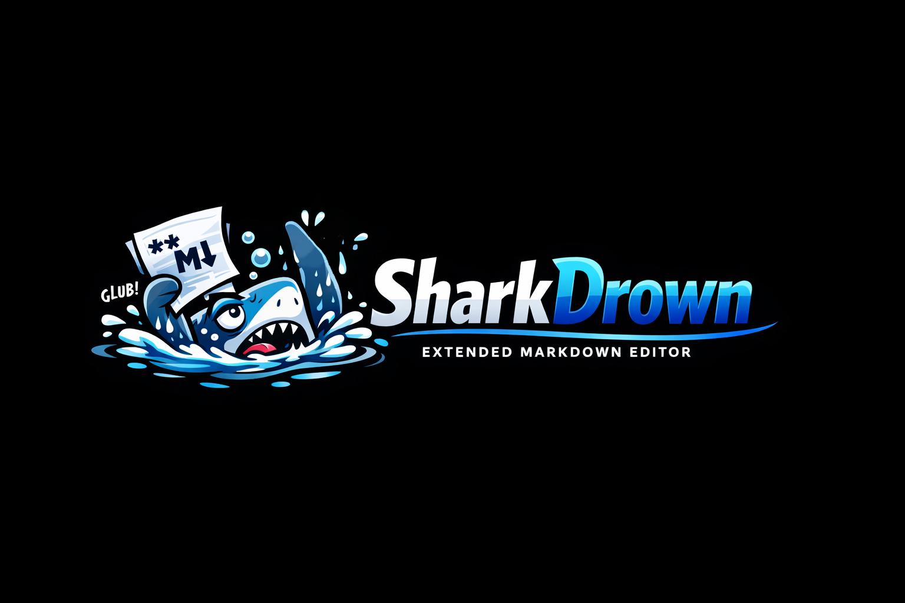

# SharkDrown

SharkDrown is a browser-based Markdown editor built for developers and sysadmins. It runs as a stateless Python/Flask container — all user state lives in the browser (`localStorage`). The name is a pun: awk → rawk → shark → SharkDrown.

GHCR image: `ghcr.io/csdougan/sharkdrown`

## Features

### Editor

- Multi-tab editor with dirty tracking and full `localStorage` persistence
- Three view modes: **code** (editor only), **split** (resizable side-by-side), **wysiwyg** (editable preview)
- Markdown syntax toolbar for common formatting shortcuts
- Line numbers — toggleable, scroll-synced with the editor
- Syntax highlighting overlay (highlight.js, idle-only to prevent input lag)
- Live Markdown preview via `/api/preview` with 300ms debounce

### File & Format Support

- File open/save via the [File System Access API](https://developer.mozilla.org/en-US/docs/Web/API/File_System_Access_API) (Chrome/Edge; direct local filesystem access when running in a container)
- **Standard Markdown** and **GitHub Flavoured Markdown (GFM)** format support
- **Confluence wiki markup** format with conversion support

### Transform Panel

Text manipulation operations that work on the full document or the current selection:

- Prefix/Suffix: add or remove a string from the start/end of each line
- Find/Replace
- Fields: split by delimiter, select/remove fields, rejoin with optional alternate delimiter
- Whitespace: strip leading/trailing whitespace, collapse internal whitespace
- Control characters: display and remove non-printable characters
- Lines: deduplicate, remove blank lines

### Line Filter Bar

Non-destructive line filter — shows only matching lines without modifying content. Eight conditions: contains, does not contain, equals, does not equal, begins with, does not begin with, ends with, does not end with. Multiple rows combine with AND or OR logic.

### Mermaid Diagram Editor

- Mermaid fenced code blocks rendered in preview via Mermaid.js
- **Visual diagram editor** supporting Flowchart, Sequence, State, and ER diagram types
- Click a rendered Mermaid diagram in the preview to open it in the visual editor
- Edit visually and insert the updated diagram back into the source Markdown tab
- Export diagrams as SVG or PNG (tight bounding box) via `showSaveFilePicker`

### Themes & Appearance

- 4 colour themes: dark, light, high contrast, warm
- 8 preview fonts selectable from Google Fonts

## Running Locally

```bash
pip install -r requirements.txt
python app.py
# → http://localhost:5000
```

```bash
docker build -t sharkdrown .
docker run -p 5000:5000 sharkdrown
```

## Deployment

SharkDrown is stateless — no sticky sessions or persistent volumes required.

- All user data is stored in browser `localStorage`
- Suitable for spot/preemptible nodes
- 2+ replicas per region recommended, spread across availability zones

## CI/CD

GitHub Actions pipeline (`.github/workflows/build.yml`):

1. **lint** — `py_compile` + `pylint --fail-under=7.0`
2. **test** — `pytest tests/` with coverage
3. **build** — Docker Buildx multi-platform (`linux/amd64`, `linux/arm64`), pushed to GHCR
4. **scan** — Trivy vulnerability scan, SARIF results to GitHub Security tab
5. **smoke-test** (PRs only) — Kind cluster deploy, curl `/healthz` and `/`

## Browser Compatibility

| Feature | Chrome/Edge | Firefox |
|---------|-------------|---------|
| Editor & preview | ✓ | ✓ |
| File open/save | ✓ | ✗ (File System Access API not available) |
| Mermaid visual editor | ✓ | ✓ |

## Tech Stack

| Layer | Technology |
|-------|-----------|
| Server | Python 3.12, Flask 3.x, Gunicorn, pymdownx |
| Client | Vanilla JS, CSS custom properties |
| Preview rendering | highlight.js 11.9 (CDN), Mermaid.js (CDN), Turndown (CDN) |
| Container | Python 3.12-slim |
| CI/CD | GitHub Actions → GHCR (multi-platform) |
